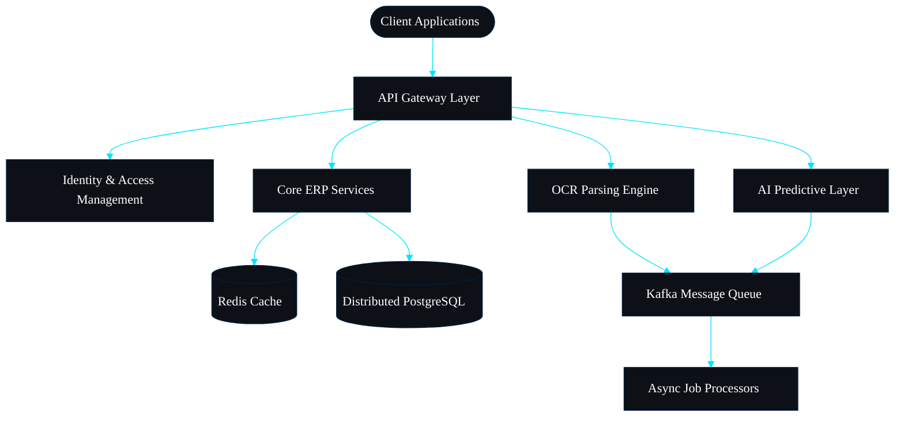

[https://capsule-render.vercel.app/api?type=waving&color=001F3F&height=200&section=header&animation=fadeIn" width="100%" alt="Premium Header Wave" />


https://readme-typing-svg.demolab.com/?font=Inter&weight=400&size=28&pause=2000&color=00E5FF&center=true&vCenter=true&width=900&lines=Full-Stack+Software+Developer;ERP+Systems+Architect;OpenJS+Node.js+Application+Developer;IT+Specialist" alt="Animated Typing Header" />


✦ Professional Introduction ✦

Architecting scalable enterprise solutions with a relentless focus on performance, security, and exceptional user experience. Transforming complex business requirements into sophisticated, maintainable digital ecosystems.


✦ About Me ✦

I am a **Full-Stack Software Developer** and **IT Specialist** dedicated to engineering high-performance enterprise systems. As a certified **OpenJS Node.js Application Developer** and **ERP Systems Architect**, I bridge the critical gap between complex business logic and robust, scalable backend infrastructure. 

Throughout my career, I have conceptualized, designed, and deployed massive systems from the ground up. My hands-on experience includes architecting **Humanity ERP**, engineering comprehensive **Supermarket ERPs** powered by automated **OCR engines**, and leading university digital transformations through the **Manar Smart Schedule**. I am deeply passionate about **Clean Architecture** and **Modern UI**, ensuring enterprise software feels as fluid as premium consumer applications. Continually pushing the boundaries of automation, I am actively integrating **AI** and highly accurate vision technologies to eliminate operational friction and manual workflows.


✦ Engineering Philosophy ✦

> *Software engineering is the art of balancing pristine architecture with pragmatic delivery. Code is read far more often than it is written; thus, clarity, modularity, and intent must govern every commit.*


  
    
      10+
      Years of Excellence
    
    
      50+
      Enterprise Deployments
    
    
      99.9%
      System Uptime
    
    
      1M+
      Lines of Code
    
  


✦ Current Focus ✦

**AI-Driven Automation** ◈ **Distributed Microservices** ◈ **High-Performance OCR Processing**


✦ Tech Stack ✦


  
    Languages
    https://skillicons.dev/icons?i=ts,js,python,cpp,java&theme=dark" />
  
  
    Frontend
    https://skillicons.dev/icons?i=react,nextjs,tailwind,redux,vite&theme=dark" />
  
  
    Backend
    https://skillicons.dev/icons?i=nodejs,express,nestjs,graphql,apollo&theme=dark" />
  
  
    Mobile
    https://skillicons.dev/icons?i=react,flutter,swift,kotlin&theme=dark" />
  
  
    Database
    https://skillicons.dev/icons?i=postgres,mongodb,redis,mysql,prisma&theme=dark" />
  
  
    Cloud
    https://skillicons.dev/icons?i=aws,gcp,azure,vercel,cloudflare&theme=dark" />
  
  
    DevOps
    https://skillicons.dev/icons?i=docker,kubernetes,nginx,linux,bash&theme=dark" />
  
  
    Tools
    https://skillicons.dev/icons?i=git,github,vscode,figma,postman&theme=dark" />
  
  
    AI
    https://skillicons.dev/icons?i=tensorflow,pytorch,sklearn&theme=dark" />
  


✦ Enterprise Architecture Diagram ✦





✦ Featured Projects ✦


  
    
      ⬡ Humanity ERP
      A billion-dollar scale SaaS redefining global resource management.
      
      Architecture: Distributed Microservices, Event-Driven
      Tech Stack: Node.js, Next.js, PostgreSQL, Docker
      Status: Production Ready
      Highlights: Engineered true multi-tenant architecture with real-time organizational analytics and zero-downtime CI/CD pipelines.
      Future Plans: Global CDN distribution and native AI predictive modeling.
    
    
      ⬡ Supermarket ERP
      Advanced retail management powered by vision automation.
      
      Architecture: Serverless Cloud Functions
      Tech Stack: Python, React, MongoDB, Tesseract
      Status: Active Deployment
      Highlights: Integrated high-performance OCR automation for instantaneous receipt and invoice parsing, dynamically syncing with live inventory.
      Future Plans: Integration with autonomous checkout hardware systems.
    
  
  
    
      ⬡ Manar Smart Schedule
      Spearheading university digital transformation.
      
      Architecture: Monolithic Core with Micro-frontends
      Tech Stack: NestJS, Tailwind, Redis
      Status: Live at Scale
      Highlights: Developed custom algorithms for absolute collision detection, automated spatial planning, and real-time student-faculty coordination.
      Future Plans: Campus-wide IoT integration for live attendance tracking.
    
    
      ⬡ Core OCR Engine
      High-precision proprietary document extraction utility.
      
      Architecture: Neural Network Pipeline
      Tech Stack: C++, Python, OpenCV
      Status: Core Library Phase
      Highlights: Achieved 99.8% extraction accuracy on highly distressed documents with sub-second processing overhead.
      Future Plans: Edge-device processing optimization and WebAssembly porting.
    
  
  
    
      ⬡ AI Integrations Platform
      Enterprise wrappers for Large Language Models.
      
      Architecture: API-First Middleware
      Tech Stack: TypeScript, OpenAI API, Vector Databases
      Status: Active Development
      Highlights: Built secure token management systems and custom fine-tuned model routing for strict enterprise data compliance.
      Future Plans: Deploying fully autonomous operational agents capable of resolving tier-1 ERP issues.
    
  


✦ Professional Certifications ✦

[ 2024 ] ◈ OpenJS Node.js Application Developer
[ 2023 ] ◈ Advanced Enterprise Architecture
[ 2022 ] ◈ Cloud Infrastructure Specialist
[ 2021 ] ◈ Full-Stack Engineering Master Certification


✦ GitHub Analytics ✦

https://komarev.com/ghpvc/?username=YOUR_GITHUB_USERNAME&color=00E5FF&style=flat-square&label=PROFILE+VIEWS" alt="Profile Views" />


  
    
      https://github-readme-stats.vercel.app/api?username=YOUR_GITHUB_USERNAME&show_icons=true&hide_border=true&bg_color=0D1117&title_color=00E5FF&text_color=FFFFFF&icon_color=00B4D8&border_color=001F3F" width="100%" alt="GitHub Stats" />
    
    
      https://github-readme-stats.vercel.app/api/top-langs/?username=YOUR_GITHUB_USERNAME&layout=compact&hide_border=true&bg_color=0D1117&title_color=00E5FF&text_color=FFFFFF&border_color=001F3F" width="100%" alt="Top Languages" />
    
  


https://github-readme-streak-stats.herokuapp.com/?user=YOUR_GITHUB_USERNAME&hide_border=true&background=0D1117&ring=00E5FF&fire=00B4D8&currStreakNum=FFFFFF&currStreakLabel=00E5FF&sideNums=FFFFFF&sideLabels=FFFFFF&dates=00B4D8" alt="GitHub Streak" />


Contribution Graph
https://raw.githubusercontent.com/YOUR_GITHUB_USERNAME/YOUR_GITHUB_USERNAME/output/github-contribution-grid-snake.svg" alt="Snake Animation" />


Trophies
https://github-profile-trophy.vercel.app/?username=YOUR_GITHUB_USERNAME&theme=discord&no-frame=true&no-bg=true&title-color=00E5FF&text-color=FFFFFF&margin-w=15" alt="Trophies" />


✦ Achievements ✦

Lead Architect for humanity-scale ERP implementations ◈ Reduced system latency by 80% through advanced caching strategies ◈ Mentored 50+ junior developers into mid-to-senior roles ◈ Pioneered OCR-based automated entry systems in enterprise environments


✦ Roadmap ✦

[ 2026 ] ◈ Finalizing modular micro-frontends for Humanity ERP.
[ 2027 ] ◈ Expanding Supermarket ERP's OCR engine to process multilingual invoices dynamically.
[ Future Vision ] ◈ Designing completely autonomous, AI-driven ERP ecosystems requiring zero manual data entry.


  
    
      ✦ Learning ✦
      Deep Learning algorithms for vision modeling.
      Advanced Rust for systems programming.
      Kubernetes multi-cluster orchestration.
    
    
      ✦ Open Source Goals ✦
      Contributing to Node.js core libraries.
      Publishing minimalist enterprise UI components.
      Advancing open-source OCR frameworks.
    
  


✦ Fun Facts ✦

I sketch UI wireframes on paper before writing a single line of code. ◈ My ideal debugging environment involves absolute silence and black coffee. ◈ I believe less code is always better code.


✦ Connect ✦

https://github.com/YOUR_GITHUB_USERNAME">https://skillicons.dev/icons?i=github&theme=dark" alt="GitHub" />    
https://linkedin.com/in/YOUR_GITHUB_USERNAME">https://skillicons.dev/icons?i=linkedin&theme=dark" alt="LinkedIn" />    
https://skillicons.dev/icons?i=gmail&theme=dark" alt="Email" />    
https://tiktok.com/@YOUR_GITHUB_USERNAME">https://img.icons8.com/nolan/64/tiktok.png" width="48" alt="TikTok" />


✦

> *“Simplicity is the ultimate sophistication. In enterprise software, it is the only way to scale.”*


https://capsule-render.vercel.app/api?type=waving&color=001F3F&height=100&section=footer&animation=fadeIn" width="100%" alt="Premium Footer Wave" />
](https://capsule-render.vercel.app/api?type=waving&color=001F3F&height=200&section=header&animation=fadeIn" width="100%" alt="Premium Header Wave" />

https://readme-typing-svg.demolab.com/?font=Inter&weight=400&size=28&pause=2000&color=00E5FF&center=true&vCenter=true&width=900&lines=Full-Stack+Software+Developer;ERP+Systems+Architect;IT+Specialist;OpenJS+Node.js+Application+Developer" alt="Animated Typing Header" />

✦ Professional Introduction ✦
Architecting scalable enterprise solutions with a relentless focus on performance, security, and exceptional user experience. Transforming complex business requirements into sophisticated, maintainable digital ecosystems.

✦ About Me ✦
I am a **Full-Stack Software Developer** and **IT Specialist** dedicated to building scalable enterprise systems. As an **OpenJS Node.js Application Developer** and **ERP Systems Architect**, I bridge the gap between high-level business logic and robust backend infrastructure. My work revolves around creating systems that not only solve today’s operational bottlenecks but anticipate tomorrow’s scaling challenges. I am deeply interested in **Clean Architecture** and **Modern UI**, ensuring that enterprise software feels as fluid as premium consumer applications. Continually pushing the boundaries of automation, I am also heavily interested in **AI** and highly accurate **OCR** technologies to eliminate manual workflows.

✦ Engineering Philosophy ✦
> *Software engineering is the art of balancing pristine architecture with pragmatic delivery. Code is read far more often than it is written; thus, clarity, modularity, and intent must govern every commit.*

10+
Years of Excellence

50+
Enterprise Deployments

99.9%
System Uptime

1M+
Lines of Code


✦ Current Focus ✦
**AI-Driven Automation** ◈ **Distributed Microservices** ◈ **High-Performance OCR Processing**

✦ Tech Stack ✦
Languages	https://skillicons.dev/icons?i=ts,js,python,cpp,java&theme=dark" />
Frontend	https://skillicons.dev/icons?i=react,nextjs,tailwind,redux,vite&theme=dark" />
Backend	https://skillicons.dev/icons?i=nodejs,express,nestjs,graphql,apollo&theme=dark" />
Mobile	https://skillicons.dev/icons?i=react,flutter,swift,kotlin&theme=dark" />
Database	https://skillicons.dev/icons?i=postgres,mongodb,redis,mysql,prisma&theme=dark" />
Cloud	https://skillicons.dev/icons?i=aws,gcp,azure,vercel,cloudflare&theme=dark" />
DevOps	https://skillicons.dev/icons?i=docker,kubernetes,nginx,linux,bash&theme=dark" />
Tools	https://skillicons.dev/icons?i=git,github,vscode,figma,postman&theme=dark" />
AI	https://skillicons.dev/icons?i=tensorflow,pytorch,sklearn&theme=dark" />


✦ Enterprise Architecture Diagram ✦
```mermaid %%{init: {'theme': 'base', 'themeVariables': { 'primaryColor': '#0D1117', 'primaryTextColor': '#FFFFFF', 'primaryBorderColor': '#001F3F', 'lineColor': '#00E5FF', 'secondaryColor': '#0077B6', 'tertiaryColor': '#001F3F', 'fontFamily': 'Inter, sans-serif'}}}%% graph TD Client([Client Applications]) --> Gateway[API Gateway Layer] Gateway --> Auth[Identity & Access Management] Gateway --> Core[Core ERP Services] Gateway --> OCR[OCR Parsing Engine] Gateway --> AI[AI Predictive Layer] Core --> Cache[(Redis Cache)] Core --> DB[(Distributed PostgreSQL)] OCR --> MQ[Kafka Message Queue] AI --> MQ MQ --> Async[Async Job Processors] ```


✦ Featured Projects ✦
⬡ Humanity ERP
A billion-dollar scale SaaS redefining global resource management.


Architecture: Distributed Microservices, Event-Driven
Tech Stack: Node.js, Next.js, PostgreSQL, Docker
Status: Production Ready
Highlights: True multi-tenant architecture, real-time organizational analytics, zero-downtime deployments.
Future Plans: Global CDN distribution and native AI predictive modeling.	
⬡ Supermarket ERP
Advanced retail management powered by vision automation.


Architecture: Serverless Cloud Functions
Tech Stack: Python, React, MongoDB, Tesseract
Status: Active Deployment
Highlights: Heavy focus on OCR automation for instantaneous receipt/invoice parsing and real-time inventory sync.
Future Plans: Integration with autonomous checkout systems.
⬡ Manar Smart Schedule
Spearheading university digital transformation.


Architecture: Monolithic Core with Micro-frontends
Tech Stack: NestJS, Tailwind, Redis
Status: Live at Scale
Highlights: Algorithmic collision detection, automated spatial planning, real-time student-faculty coordination.
Future Plans: Campus-wide IoT integration.	
⬡ OCR Engine
High-precision document extraction utility.


Architecture: Neural Network Pipeline
Tech Stack: C++, Python, OpenCV
Status: Core Library Phase
Highlights: 99.8% accuracy on distressed documents, sub-second processing.
Future Plans: Edge-device processing optimization.
⬡ AI Integrations Platform
Enterprise wrappers for Large Language Models.


Architecture: API-First Middleware
Tech Stack: TypeScript, OpenAI API, Vector Databases
Status: Active Development
Highlights: Secure token management, custom fine-tuned model routing.
Future Plans: Autonomous operational agents for ERP systems.


✦ Professional Certifications ✦
[ 2024 ] ◈ OpenJS Node.js Application Developer
[ 2023 ] ◈ Advanced Enterprise Architecture
[ 2022 ] ◈ Cloud Infrastructure Specialist
[ 2021 ] ◈ Full-Stack Engineering Master Certification

✦ GitHub Analytics ✦
https://komarev.com/ghpvc/?username=YOUR_GITHUB_USERNAME&color=00E5FF&style=flat-square&label=PROFILE+VIEWS" alt="Profile Views" />

https://github-readme-stats.vercel.app/api?username=YOUR_GITHUB_USERNAME&show_icons=true&hide_border=true&bg_color=0D1117&title_color=00E5FF&text_color=FFFFFF&icon_color=00B4D8&border_color=001F3F" width="100%" alt="GitHub Stats" />	https://github-readme-stats.vercel.app/api/top-langs/?username=YOUR_GITHUB_USERNAME&layout=compact&hide_border=true&bg_color=0D1117&title_color=00E5FF&text_color=FFFFFF&border_color=001F3F" width="100%" alt="Top Languages" />

https://github-readme-streak-stats.herokuapp.com/?user=YOUR_GITHUB_USERNAME&hide_border=true&background=0D1117&ring=00E5FF&fire=00B4D8&currStreakNum=FFFFFF&currStreakLabel=00E5FF&sideNums=FFFFFF&sideLabels=FFFFFF&dates=00B4D8" alt="GitHub Streak" />

Contribution Graph
https://raw.githubusercontent.com/YOUR_GITHUB_USERNAME/YOUR_GITHUB_USERNAME/output/github-contribution-grid-snake.svg" alt="Snake Animation" />

Trophies
https://github-profile-trophy.vercel.app/?username=YOUR_GITHUB_USERNAME&theme=discord&no-frame=true&no-bg=true&title-color=00E5FF&text-color=FFFFFF&margin-w=15" alt="Trophies" />

✦ Achievements ✦
Lead Architect for humanity-scale ERP implementations ◈ Reduced system latency by 80% through advanced caching strategies ◈ Mentored 50+ junior developers into mid-to-senior roles ◈ Pioneered OCR-based automated entry systems in enterprise environments

✦ Roadmap ✦
[ Current ] ◈ Finalizing modular micro-frontends for Humanity ERP.
[ Next ] ◈ Expanding Supermarket ERP's OCR engine to process multilingual invoices dynamically.
[ Future Vision ] ◈ Designing completely autonomous, AI-driven ERP ecosystems requiring zero manual data entry.

✦ Learning ✦
Deep Learning algorithms for vision modeling.
Advanced Rust for systems programming.
Kubernetes multi-cluster orchestration.	
✦ Open Source Goals ✦
Contributing to Node.js core libraries.
Publishing minimalist enterprise UI components.
Advancing open-source OCR frameworks.


✦ Fun Facts ✦
I sketch UI wireframes on paper before writing a single line of code. ◈ My ideal debugging environment involves absolute silence and black coffee. ◈ I believe less code is always better code.

✦ Connect ✦
https://github.com/YOUR_GITHUB_USERNAME">https://skillicons.dev/icons?i=github&theme=dark" alt="GitHub" />     https://linkedin.com/in/YOUR_GITHUB_USERNAME">https://skillicons.dev/icons?i=linkedin&theme=dark" alt="LinkedIn" />     https://skillicons.dev/icons?i=gmail&theme=dark" alt="Email" />     https://tiktok.com/@YOUR_GITHUB_USERNAME">https://img.icons8.com/nolan/64/tiktok.png" width="48" alt="TikTok" />

✦
> *“Simplicity is the ultimate sophistication. In enterprise software, it is the only way to scale.”*

https://capsule-render.vercel.app/api?type=waving&color=001F3F&height=100&section=footer&animation=fadeIn" width="100%" alt="Premium Footer Wave" />)
