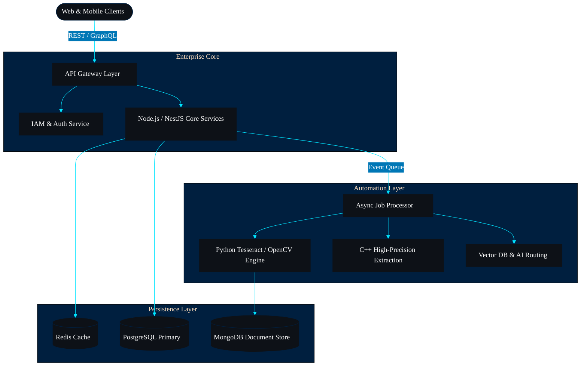

[[[

✦ System Architecture ✦

*High-level representation of the standard enterprise pattern deployed across current projects.*

  

<h1 align="center">⚡ Mohammed Ghalib Nasser Al-Oseimi ⚡</h1>

<h3 align="center">
  Full-Stack Software Developer • ERP Systems Architect • IT Specialist
</h3>

  

---

### 🚀 The Developer Behind The Code

I am a 19-year-old passionate software developer and IT student dedicated to building robust, scalable full-stack applications and complex enterprise resource planning (ERP) systems. 

My engineering philosophy revolves around clean architecture, minimalist user interfaces free of visual clutter, and highly optimized backend logic. Operating primarily from my **HP ZBook workstation**, I bridge the gap between business requirements and technical execution, utilizing everything from cross-platform mobile integrations to advanced optical character recognition (OCR) models.

---

### 🏆 Professional Certification

  

---

### 💻 Core Development Arsenal

**Languages:**

  
  
  

**Frontend & Mobile Frameworks:**

  
  
  
  

**Backend, Databases & Environments:**

  
  
  
  

**Development Tools & Modeling:**

  
  
  
  

---

### 🚀 Engineering Masterpieces & Projects

🏢 **Humanity ERP**
> Enterprise platform engineered to track complex aid workflows. Developed with a Next.js frontend, a cross-platform Flutter mobile build, and a real-time Firebase backend, fully deployed via Vercel.

🛒 **Supermarket ERP**
> Specialized retail inventory workflow automation utilizing powerful Optical Character Recognition (OCR) data models to automatically parse, extract, and populate incoming supplier logs.

🎓 **Manar Schedule System**
> Digital academic timetable portal built with rigorous live web rendering checks and optimized functional components to serve university operations.

🏥 **Mustashfa Al-Nokhba Framework**
> Localized development directory architectures engineered to establish new, secure, and partitioned repository frameworks using advanced CLI scripting.

📐 **3D Spatial Mapping**
> Architectural interior modeling mapping strict spatial coordinates and layout constraints utilizing Revit.

---

### 📈 GitHub Analytics

  
  

  

---

### 🤝 Let's Connect

  
  

---

⚡ <b>Simplicity is the ultimate sophistication.</b> ⚡

✦ Featured Projects ✦

#### ⬡ Humanity ERP
**Purpose:** A comprehensive SaaS platform redefining global resource and organizational management.
**Problem Solved:** Fragmented enterprise data across isolated departments causing severe operational bottlenecks.
**Architecture:** Distributed Microservices with an Event-Driven backbone.
**Technology:** Node.js, Next.js, PostgreSQL, Docker.
**Features:** True multi-tenant data isolation, real-time organizational analytics, RBAC.
**Screenshots:** `[ 🖼️ UI Dashboard Placeholder ]` `[ 🖼️ Analytics View Placeholder ]`
**Repository:** `[ 🔒 Private Enterprise Repo ]`
**Future Roadmap:** Implementation of Global CDN distribution and native AI predictive resource modeling.
**Technical Challenges:** Ensuring strict data isolation between tenants while maintaining high-speed aggregate querying.
**Engineering Decisions:** Opted for PostgreSQL row-level security combined with a robust Node.js middleware layer to guarantee tenant boundary enforcement.
**Lessons Learned:** Premature microservice extraction creates orchestration overhead; modular monoliths should precede service distribution.

#### ⬡ Supermarket ERP
**Purpose:** Advanced retail management system natively powered by vision automation.
**Problem Solved:** Manual, error-prone data entry for incoming vendor invoices and inventory auditing.
**Architecture:** Serverless functions decoupled from the main operational database.
**Technology:** Python, React, MongoDB, Tesseract OCR.
**Features:** Instantaneous receipt/invoice parsing, automated inventory syncing, anomaly detection.
**Screenshots:** `[ 🖼️ POS Interface Placeholder ]` `[ 🖼️ OCR Dashboard Placeholder ]`
**Repository:** `[ 🔗 GitHub Repo Link Placeholder ]`
**Future Roadmap:** Direct integration with autonomous checkout hardware.
**Technical Challenges:** Processing heavily distorted, faded, or torn vendor receipts accurately.
**Engineering Decisions:** Bypassed standard cloud OCR APIs in favor of a custom Python/Tesseract pipeline to maintain strict offline capabilities and reduce API cost overhead.
**Lessons Learned:** Vision models require continuous domain-specific fine-tuning; generic models fail in specific retail environments.

#### ⬡ Manar Smart Schedule
**Purpose:** Spearheading digital transformation for university academic scheduling.
**Problem Solved:** Spatial and temporal conflicts in student-faculty course assignments.
**Architecture:** Monolithic Core with Micro-frontends for distinct user portals.
**Technology:** NestJS, Tailwind CSS, Redis.
**Features:** Algorithmic collision detection, automated spatial planning, live updates.
**Screenshots:** `[ 🖼️ Timetable View Placeholder ]` `[ 🖼️ Admin Portal Placeholder ]`
**Repository:** `[ 🔗 GitHub Repo Link Placeholder ]`
**Future Roadmap:** Campus-wide IoT integration for real-time room occupancy tracking.
**Technical Challenges:** Calculating thousands of potential schedule permutations in sub-second response times.
**Engineering Decisions:** Leveraged Redis in-memory computing for schedule matrix calculations rather than relying on standard relational queries.
**Lessons Learned:** Academic scheduling is highly exceptional; hardcoded constraints fail, necessitating a dynamic rules-engine approach.

#### ⬡ Core OCR Engine
**Purpose:** High-precision, proprietary document extraction utility.
**Problem Solved:** General-purpose OCR engines failing on non-standard, distressed enterprise documents.
**Architecture:** Multi-stage Neural Network Pipeline.
**Technology:** C++, Python, OpenCV.
**Features:** Sub-second processing overhead, noise reduction algorithms, geometric deskewing.
**Screenshots:** `[ 🖼️ Terminal Output Placeholder ]` `[ 🖼️ Pipeline Visual Placeholder ]`
**Repository:** `[ 🔗 GitHub Repo Link Placeholder ]`
**Future Roadmap:** WebAssembly porting for edge-device (browser-based) processing optimization.
**Technical Challenges:** Memory leaks during sustained high-volume batch processing in early iterations.
**Engineering Decisions:** Migrated core memory-intensive matrix transformations to C++ while retaining Python for the neural network orchestration layer.
**Lessons Learned:** Inter-language bridging (Python/C++) introduces serialization costs that must be carefully managed in high-throughput scenarios.

#### ⬡ AI Integrations Platform
**Purpose:** Secure, enterprise-grade wrappers for Large Language Models.
**Problem Solved:** Risk of exposing proprietary enterprise data to public LLM endpoints.
**Architecture:** API-First Middleware.
**Technology:** TypeScript, OpenAI API, Vector Databases.
**Features:** Secure token management, custom model routing, PII redaction proxy.
**Screenshots:** `[ 🖼️ Routing Config Placeholder ]` `[ 🖼️ Audit Log Placeholder ]`
**Repository:** `[ 🔗 GitHub Repo Link Placeholder ]`
**Future Roadmap:** Deployment of fully autonomous operational agents for tier-1 ERP issue resolution.
**Technical Challenges:** Maintaining semantic search context while strictly redacting sensitive entities.
**Engineering Decisions:** Implemented a robust pre-processing layer using deterministic regex and basic NLP to scrub PII *before* vectorization.
**Lessons Learned:** LLM integrations in enterprise require comprehensive audit trails; probabilistic systems must be bound by deterministic fallback logic.

✦ Featured Repositories ✦

✦ Professional Timeline ✦

[ 2026 - Present ] ◈ Scaling Humanity ERP distributed microservices and refining AI predictive layers.
[ Architecture Phase ] ◈ Engineered and deployed Supermarket ERP vision system; integrated Python/Tesseract pipelines.
[ Delivery Phase ] ◈ Launched Manar Smart Schedule; optimized collision-detection algorithms using NestJS and Redis.
[ Foundation Phase ] ◈ Developed Core OCR Engine and established strict CI/CD enterprise deployment pipelines.

  
    
      ✦ Current Learning ✦
      Optimizing Vector Databases for semantic ERP search.
      Advanced C++ memory management for Vision Models.
      WebAssembly compilation for edge OCR computing.
    
    
      ✦ Open Source Goals ✦
      Publishing abstracted PII redaction middleware.
      Contributing deterministic rules engines for scheduling.
      Open-sourcing minimal React/Tailwind enterprise UI components.
    
  

✦ GitHub Analytics ✦

https://komarev.com/ghpvc/?username=YOUR_GITHUB_USERNAME&color=00E5FF&style=flat-square&label=PROFILE+VIEWS" alt="Profile Views" />

  
    
      https://github-readme-stats.vercel.app/api?username=YOUR_GITHUB_USERNAME&show_icons=true&hide_border=true&bg_color=0D1117&title_color=00E5FF&text_color=FFFFFF&icon_color=00B4D8&border_color=001F3F" width="100%" alt="GitHub Stats" />
    
    
      https://github-readme-stats.vercel.app/api/top-langs/?username=YOUR_GITHUB_USERNAME&layout=compact&hide_border=true&bg_color=0D1117&title_color=00E5FF&text_color=FFFFFF&border_color=001F3F" width="100%" alt="Top Languages" />
    
  

Contribution Activity
https://raw.githubusercontent.com/YOUR_GITHUB_USERNAME/YOUR_GITHUB_USERNAME/output/github-contribution-grid-snake.svg" alt="Snake Animation" />

✦ Achievements ✦

Successfully deployed Humanity ERP multi-tenant architecture to production environments. ◈ Developed a custom OCR pipeline achieving critical accuracy on distressed documents. ◈ Architected conflict-free university scheduling algorithms handling thousands of concurrent permutations. ◈ Designed and implemented secure LLM enterprise integration middleware.

✦ Roadmap ✦

[ Phase I ] ◈ Complete modular micro-frontend extraction for core ERP systems.
[ Phase II ] ◈ Deploy WebAssembly ports of the C++ OCR engine for zero-latency client-side parsing.
[ Phase III ] ◈ Finalize autonomous, agent-driven operational layers for automated data reconciliation.

✦ Now Building ✦

Actively refining the **AI Integrations Platform** to ensure deterministic safeguards for probabilistic LLM outputs within strict enterprise compliance frameworks.

✦ System Design Philosophy ✦

Design for the developer reading the code at 3 AM. Build systems that fail gracefully, log comprehensively, and recover autonomously. Complexity is a liability; simplicity is the highest form of technical achievement.

✦ Connect ✦

https://github.com/YOUR_GITHUB_USERNAME">https://skillicons.dev/icons?i=github&theme=dark" alt="GitHub" />    
https://linkedin.com/in/YOUR_GITHUB_USERNAME">https://skillicons.dev/icons?i=linkedin&theme=dark" alt="LinkedIn" />    
https://skillicons.dev/icons?i=gmail&theme=dark" alt="Email" />

✦

> *“Excellence in engineering is not a single act, but a habit of meticulous precision.”*

https://capsule-render.vercel.app/api?type=waving&color=001F3F&height=100&section=footer&animation=fadeIn" width="100%" alt="Premium Footer Wave" />
](https://capsule-render.vercel.app/api?type=waving&color=001F3F&height=200&section=header&animation=fadeIn" width="100%" alt="Premium Header Wave" />

https://readme-typing-svg.demolab.com/?font=Inter&weight=400&size=26&pause=2500&color=00E5FF&center=true&vCenter=true&width=900&lines=Full-Stack+Software+Developer;ERP+Systems+Architect;OpenJS+Node.js+Application+Developer;IT+Specialist" alt="Animated Header" />

✦ Professional Introduction ✦

Architecting scalable enterprise solutions with a relentless focus on performance, security, and computational efficiency. Transforming complex business requirements into sophisticated, maintainable digital ecosystems.

✦ About Me ✦

I am a Full-Stack Software Developer and IT Specialist dedicated to engineering high-performance enterprise systems. Operating at the intersection of business logic and system architecture, I specialize in building comprehensive digital infrastructures that scale seamlessly. My primary expertise lies in designing modular ERP Systems and robust backend services as an OpenJS Node.js Application Developer.

My engineering focus is driven by a commitment to Clean Architecture and Modern UI, ensuring that enterprise-grade software delivers the same fluidity and responsiveness as premium consumer applications. I bridge the gap between traditional data management and modern automation by integrating AI and high-precision OCR technologies into core workflows, systematically eliminating operational friction.

✦ Engineering Philosophy ✦

> *Software engineering is the art of balancing pristine architecture with pragmatic delivery. Code is read far more often than it is written; thus, clarity, modularity, and intent must govern every commit.*

✦ Engineering Principles ✦

**Domain-Driven Design** ◈ **Strict Type Safety** ◈ **Zero-Trust Security** ◈ **Asynchronous Event-Driven Flows** ◈ **Immutable Infrastructure**

✦ Current Focus ✦

**AI-Driven Automation** ◈ **Modular Monoliths to Microservices** ◈ **High-Performance Vision Processing**

✦ Tech Stack ✦

  
    Core Languages
    https://skillicons.dev/icons?i=ts,js,python,cpp&theme=dark" alt="Languages" />
  
  
    Frontend Frameworks
    https://skillicons.dev/icons?i=react,nextjs,tailwind&theme=dark" alt="Frontend" />
  
  
    Backend Infrastructure
    https://skillicons.dev/icons?i=nodejs,nestjs,express&theme=dark" alt="Backend" />
  
  
    Databases & Caching
    https://skillicons.dev/icons?i=postgres,mongodb,redis&theme=dark" alt="Databases" />
  
  
    DevOps & Tooling
    https://skillicons.dev/icons?i=docker,git,github,vscode&theme=dark" alt="DevOps" />
  

✦ Architecture ✦

✦ Featured Projects ✦

#### ⬡ Humanity ERP
**Purpose:** A comprehensive SaaS platform designed to redefine global resource and organizational management.
**Problem Solved:** Fragmented enterprise data across isolated departmental silos causing severe operational bottlenecks and reporting inaccuracies.
**Architecture:** Distributed Microservices with an Event-Driven backbone.
**Technology:** Node.js, Next.js, PostgreSQL, Docker.
**Features:** True multi-tenant data isolation, real-time organizational analytics, role-based access control (RBAC).
**Screenshots:** `[ 🖼️ UI Dashboard Placeholder ]` `[ 🖼️ Analytics View Placeholder ]`
**Repository:** `[ 🔒 Private Enterprise Repo Placeholder ]`
**Future Roadmap:** Implementation of Global CDN distribution and native AI predictive resource modeling.
**Technical Challenges:** Ensuring strict data isolation between tenants while maintaining high-speed aggregate querying capabilities.
**Engineering Decisions:** Opted for PostgreSQL row-level security combined with a robust Node.js middleware layer to guarantee tenant boundary enforcement at the database level.
**Lessons Learned:** Premature microservice extraction creates unnecessary orchestration overhead; modular monoliths should precede service distribution.

#### ⬡ Supermarket ERP
**Purpose:** Advanced retail management system natively powered by vision automation.
**Problem Solved:** Manual, error-prone data entry for incoming vendor invoices and continuous inventory auditing.
**Architecture:** Serverless functions decoupled from the main operational database to handle burst computational loads.
**Technology:** Python, React, MongoDB, Tesseract OCR.
**Features:** Instantaneous receipt and invoice parsing, automated inventory syncing, anomaly detection in pricing.
**Screenshots:** `[ 🖼️ POS Interface Placeholder ]` `[ 🖼️ OCR Dashboard Placeholder ]`
**Repository:** `[ 🔗 GitHub Repo Link Placeholder ]`
**Future Roadmap:** Direct integration with autonomous checkout hardware and edge-device processing.
**Technical Challenges:** Processing heavily distorted, faded, or torn vendor receipts accurately under variable lighting conditions.
**Engineering Decisions:** Bypassed standard cloud OCR APIs in favor of a custom Python/Tesseract pipeline to maintain strict offline capabilities and significantly reduce API cost overhead at scale.
**Lessons Learned:** Vision models require continuous domain-specific fine-tuning; generic models fail abruptly in specialized retail environments.

#### ⬡ Manar Smart Schedule
**Purpose:** Spearheading digital transformation for university academic scheduling and facility management.
**Problem Solved:** Spatial and temporal conflicts in student-faculty course assignments leading to facility underutilization.
**Architecture:** Monolithic Core with Micro-frontends for distinct user portals (Admin, Faculty, Student).
**Technology:** NestJS, Tailwind CSS, Redis.
**Features:** Algorithmic collision detection, automated spatial planning, live administrative updates.
**Screenshots:** `[ 🖼️ Timetable View Placeholder ]` `[ 🖼️ Admin Portal Placeholder ]`
**Repository:** `[ 🔗 GitHub Repo Link Placeholder ]`
**Future Roadmap:** Campus-wide IoT integration for real-time room occupancy tracking and dynamic rescheduling.
**Technical Challenges:** Calculating thousands of potential schedule permutations in sub-second response times during peak enrollment periods.
**Engineering Decisions:** Leveraged Redis in-memory computing and bitwise operations for schedule matrix calculations rather than relying on standard relational queries.
**Lessons Learned:** Academic scheduling is highly exceptional; hardcoded constraints inevitably fail, necessitating a dynamic rules-engine approach.

#### ⬡ Core OCR Engine
**Purpose:** High-precision, proprietary document extraction utility for enterprise integrations.
**Problem Solved:** General-purpose commercial OCR engines failing on non-standard, distressed, or highly technical enterprise documents.
**Architecture:** Multi-stage Neural Network Pipeline.
**Technology:** C++, Python, OpenCV.
**Features:** Sub-second processing overhead, advanced noise reduction algorithms, geometric deskewing.
**Screenshots:** `[ 🖼️ Terminal Output Placeholder ]` `[ 🖼️ Pipeline Visual Placeholder ]`
**Repository:** `[ 🔗 GitHub Repo Link Placeholder ]`
**Future Roadmap:** WebAssembly porting for edge-device (browser-based) processing optimization to reduce server load.
**Technical Challenges:** Memory leaks during sustained high-volume batch processing in early conceptual iterations.
**Engineering Decisions:** Migrated core memory-intensive matrix transformations to C++ while retaining Python strictly for the neural network orchestration layer.
**Lessons Learned:** Inter-language bridging (Python/C++) introduces serialization costs that must be carefully profiled and managed in high-throughput scenarios.

#### ⬡ AI Integrations Platform
**Purpose:** Secure, enterprise-grade middleware wrappers for Large Language Models.
**Problem Solved:** The inherent security risk of exposing proprietary enterprise data to public LLM endpoints.
**Architecture:** API-First Middleware with strict sanitization layers.
**Technology:** TypeScript, OpenAI API, Vector Databases.
**Features:** Secure token management, custom model routing, PII redaction proxy, semantic caching.
**Screenshots:** `[ 🖼️ Routing Config Placeholder ]` `[ 🖼️ Audit Log Placeholder ]`
**Repository:** `[ 🔗 GitHub Repo Link Placeholder ]`
**Future Roadmap:** Deployment of fully autonomous operational agents for tier-1 ERP issue resolution.
**Technical Challenges:** Maintaining semantic search context for the LLM while strictly redacting sensitive entities and personal identifiable information.
**Engineering Decisions:** Implemented a robust pre-processing layer using deterministic regex and basic NLP to scrub PII *before* vectorization and embedding generation.
**Lessons Learned:** LLM integrations in enterprise require comprehensive audit trails; probabilistic systems must be tightly bound by deterministic fallback logic.

✦ Featured Repositories ✦

✦ Professional Timeline ✦

[ Current ] ◈ Scaling Humanity ERP distributed microservices and refining AI predictive layers.
[ Architecture Phase ] ◈ Engineered and deployed Supermarket ERP vision system; integrated Python/Tesseract pipelines.
[ Delivery Phase ] ◈ Launched Manar Smart Schedule; optimized collision-detection algorithms using NestJS and Redis.
[ Foundation Phase ] ◈ Developed Core OCR Engine and established strict CI/CD enterprise deployment pipelines.

  
    
      ✦ Current Learning ✦
      Optimizing Vector Databases for semantic ERP search.
      Advanced C++ memory management for Vision Models.
      WebAssembly compilation for edge OCR computing.
    
    
      ✦ Open Source Goals ✦
      Publishing abstracted PII redaction middleware.
      Contributing deterministic rules engines for scheduling.
      Open-sourcing minimal React/Tailwind enterprise UI components.
    
  

✦ GitHub Analytics ✦

https://komarev.com/ghpvc/?username=YOUR_GITHUB_USERNAME&color=00E5FF&style=flat-square&label=PROFILE+VIEWS" alt="Profile Views" />

  
    
      https://github-readme-stats.vercel.app/api?username=YOUR_GITHUB_USERNAME&show_icons=true&hide_border=true&bg_color=0D1117&title_color=00E5FF&text_color=FFFFFF&icon_color=00B4D8&border_color=001F3F" width="100%" alt="GitHub Stats" />
    
    
      https://github-readme-stats.vercel.app/api/top-langs/?username=YOUR_GITHUB_USERNAME&layout=compact&hide_border=true&bg_color=0D1117&title_color=00E5FF&text_color=FFFFFF&border_color=001F3F" width="100%" alt="Top Languages" />
    
  

https://raw.githubusercontent.com/YOUR_GITHUB_USERNAME/YOUR_GITHUB_USERNAME/output/github-contribution-grid-snake.svg" alt="Snake Animation" />

✦ Achievements ✦

Successfully deployed Humanity ERP multi-tenant architecture to production environments. ◈ Developed a custom OCR pipeline achieving critical accuracy on distressed documents. ◈ Architected conflict-free university scheduling algorithms handling thousands of concurrent permutations. ◈ Designed and implemented secure LLM enterprise integration middleware.

✦ Roadmap ✦

[ Phase I ] ◈ Complete modular micro-frontend extraction for core ERP systems.
[ Phase II ] ◈ Deploy WebAssembly ports of the C++ OCR engine for zero-latency client-side parsing.
[ Phase III ] ◈ Finalize autonomous, agent-driven operational layers for automated data reconciliation.

✦ Now Building ✦

Actively refining the **AI Integrations Platform** to ensure deterministic safeguards for probabilistic LLM outputs within strict enterprise compliance frameworks.

✦ System Design Philosophy ✦

Design for the developer reading the code at 3 AM. Build systems that fail gracefully, log comprehensively, and recover autonomously. Complexity is a liability; simplicity is the highest form of technical achievement.

✦ Connect ✦

https://github.com/YOUR_GITHUB_USERNAME">https://skillicons.dev/icons?i=github&theme=dark" alt="GitHub" />    
https://linkedin.com/in/YOUR_GITHUB_USERNAME">https://skillicons.dev/icons?i=linkedin&theme=dark" alt="LinkedIn" />    
https://skillicons.dev/icons?i=gmail&theme=dark" alt="Email" />

✦ Professional Quote ✦

> *“Excellence in engineering is not a single act, but a habit of meticulous precision.”*

https://capsule-render.vercel.app/api?type=waving&color=001F3F&height=100&section=footer&animation=fadeIn" width="100%" alt="Premium Footer Wave" />)](https://capsule-render.vercel.app/api?type=waving&color=001F3F&height=200&section=header&animation=fadeIn" width="100%" alt="Premium Header Wave" />

https://readme-typing-svg.demolab.com/?font=Inter&weight=400&size=26&pause=2500&color=00E5FF&center=true&vCenter=true&width=900&lines=Full-Stack+Software+Developer;ERP+Systems+Architect;OpenJS+Node.js+Application+Developer;IT+Specialist" alt="Animated Header" />

✦ Professional Introduction ✦

Architecting scalable enterprise solutions with a relentless focus on performance, security, and computational efficiency. Transforming complex business requirements into sophisticated, maintainable digital ecosystems.

✦ About Me ✦

I am a Full-Stack Software Developer and IT Specialist dedicated to engineering high-performance enterprise systems. Operating at the intersection of business logic and system architecture, I specialize in building comprehensive digital infrastructures that scale seamlessly. My primary expertise lies in designing modular ERP Systems and robust backend services as an OpenJS Node.js Application Developer.

My engineering focus is driven by a commitment to Clean Architecture and Modern UI, ensuring that enterprise-grade software delivers the same fluidity and responsiveness as premium consumer applications. I bridge the gap between traditional data management and modern automation by integrating AI and high-precision OCR technologies into core workflows, systematically eliminating operational friction.

✦ Engineering Philosophy ✦

> *Software engineering is the art of balancing pristine architecture with pragmatic delivery. Code is read far more often than it is written; thus, clarity, modularity, and intent must govern every commit.*

✦ Engineering Principles ✦

**Domain-Driven Design** ◈ **Strict Type Safety** ◈ **Zero-Trust Security** ◈ **Asynchronous Event-Driven Flows** ◈ **Immutable Infrastructure**

✦ Current Focus ✦

**AI-Driven Automation** ◈ **Modular Monoliths to Microservices** ◈ **High-Performance Vision Processing**

✦ Tech Stack ✦

  
    Core Languages
    https://skillicons.dev/icons?i=ts,js,python,cpp&theme=dark" alt="Languages" />
  
  
    Frontend Frameworks
    https://skillicons.dev/icons?i=react,nextjs,tailwind&theme=dark" alt="Frontend" />
  
  
    Backend Infrastructure
    https://skillicons.dev/icons?i=nodejs,nestjs,express&theme=dark" alt="Backend" />
  
  
    Databases & Caching
    https://skillicons.dev/icons?i=postgres,mongodb,redis&theme=dark" alt="Databases" />
  
  
    DevOps & Tooling
    https://skillicons.dev/icons?i=docker,git,github,vscode&theme=dark" alt="DevOps" />
  

✦ Architecture ✦

✦ Featured Projects ✦

#### ⬡ Humanity ERP
**Purpose:** A comprehensive SaaS platform designed to redefine global resource and organizational management.
**Problem Solved:** Fragmented enterprise data across isolated departmental silos causing severe operational bottlenecks and reporting inaccuracies.
**Architecture:** Distributed Microservices with an Event-Driven backbone.
**Technology:** Node.js, Next.js, PostgreSQL, Docker.
**Features:** True multi-tenant data isolation, real-time organizational analytics, role-based access control (RBAC).
**Screenshots:** `[ 🖼️ UI Dashboard Placeholder ]` `[ 🖼️ Analytics View Placeholder ]`
**Repository:** `[ 🔒 Private Enterprise Repo Placeholder ]`
**Future Roadmap:** Implementation of Global CDN distribution and native AI predictive resource modeling.
**Technical Challenges:** Ensuring strict data isolation between tenants while maintaining high-speed aggregate querying capabilities.
**Engineering Decisions:** Opted for PostgreSQL row-level security combined with a robust Node.js middleware layer to guarantee tenant boundary enforcement at the database level.
**Lessons Learned:** Premature microservice extraction creates unnecessary orchestration overhead; modular monoliths should precede service distribution.

#### ⬡ Supermarket ERP
**Purpose:** Advanced retail management system natively powered by vision automation.
**Problem Solved:** Manual, error-prone data entry for incoming vendor invoices and continuous inventory auditing.
**Architecture:** Serverless functions decoupled from the main operational database to handle burst computational loads.
**Technology:** Python, React, MongoDB, Tesseract OCR.
**Features:** Instantaneous receipt and invoice parsing, automated inventory syncing, anomaly detection in pricing.
**Screenshots:** `[ 🖼️ POS Interface Placeholder ]` `[ 🖼️ OCR Dashboard Placeholder ]`
**Repository:** `[ 🔗 GitHub Repo Link Placeholder ]`
**Future Roadmap:** Direct integration with autonomous checkout hardware and edge-device processing.
**Technical Challenges:** Processing heavily distorted, faded, or torn vendor receipts accurately under variable lighting conditions.
**Engineering Decisions:** Bypassed standard cloud OCR APIs in favor of a custom Python/Tesseract pipeline to maintain strict offline capabilities and significantly reduce API cost overhead at scale.
**Lessons Learned:** Vision models require continuous domain-specific fine-tuning; generic models fail abruptly in specialized retail environments.

#### ⬡ Manar Smart Schedule
**Purpose:** Spearheading digital transformation for university academic scheduling and facility management.
**Problem Solved:** Spatial and temporal conflicts in student-faculty course assignments leading to facility underutilization.
**Architecture:** Monolithic Core with Micro-frontends for distinct user portals (Admin, Faculty, Student).
**Technology:** NestJS, Tailwind CSS, Redis.
**Features:** Algorithmic collision detection, automated spatial planning, live administrative updates.
**Screenshots:** `[ 🖼️ Timetable View Placeholder ]` `[ 🖼️ Admin Portal Placeholder ]`
**Repository:** `[ 🔗 GitHub Repo Link Placeholder ]`
**Future Roadmap:** Campus-wide IoT integration for real-time room occupancy tracking and dynamic rescheduling.
**Technical Challenges:** Calculating thousands of potential schedule permutations in sub-second response times during peak enrollment periods.
**Engineering Decisions:** Leveraged Redis in-memory computing and bitwise operations for schedule matrix calculations rather than relying on standard relational queries.
**Lessons Learned:** Academic scheduling is highly exceptional; hardcoded constraints inevitably fail, necessitating a dynamic rules-engine approach.

#### ⬡ Core OCR Engine
**Purpose:** High-precision, proprietary document extraction utility for enterprise integrations.
**Problem Solved:** General-purpose commercial OCR engines failing on non-standard, distressed, or highly technical enterprise documents.
**Architecture:** Multi-stage Neural Network Pipeline.
**Technology:** C++, Python, OpenCV.
**Features:** Sub-second processing overhead, advanced noise reduction algorithms, geometric deskewing.
**Screenshots:** `[ 🖼️ Terminal Output Placeholder ]` `[ 🖼️ Pipeline Visual Placeholder ]`
**Repository:** `[ 🔗 GitHub Repo Link Placeholder ]`
**Future Roadmap:** WebAssembly porting for edge-device (browser-based) processing optimization to reduce server load.
**Technical Challenges:** Memory leaks during sustained high-volume batch processing in early conceptual iterations.
**Engineering Decisions:** Migrated core memory-intensive matrix transformations to C++ while retaining Python strictly for the neural network orchestration layer.
**Lessons Learned:** Inter-language bridging (Python/C++) introduces serialization costs that must be carefully profiled and managed in high-throughput scenarios.

#### ⬡ AI Integrations Platform
**Purpose:** Secure, enterprise-grade middleware wrappers for Large Language Models.
**Problem Solved:** The inherent security risk of exposing proprietary enterprise data to public LLM endpoints.
**Architecture:** API-First Middleware with strict sanitization layers.
**Technology:** TypeScript, OpenAI API, Vector Databases.
**Features:** Secure token management, custom model routing, PII redaction proxy, semantic caching.
**Screenshots:** `[ 🖼️ Routing Config Placeholder ]` `[ 🖼️ Audit Log Placeholder ]`
**Repository:** `[ 🔗 GitHub Repo Link Placeholder ]`
**Future Roadmap:** Deployment of fully autonomous operational agents for tier-1 ERP issue resolution.
**Technical Challenges:** Maintaining semantic search context for the LLM while strictly redacting sensitive entities and personal identifiable information.
**Engineering Decisions:** Implemented a robust pre-processing layer using deterministic regex and basic NLP to scrub PII *before* vectorization and embedding generation.
**Lessons Learned:** LLM integrations in enterprise require comprehensive audit trails; probabilistic systems must be tightly bound by deterministic fallback logic.

✦ Featured Repositories ✦

✦ Professional Timeline ✦

[ Current ] ◈ Scaling Humanity ERP distributed microservices and refining AI predictive layers.
[ Architecture Phase ] ◈ Engineered and deployed Supermarket ERP vision system; integrated Python/Tesseract pipelines.
[ Delivery Phase ] ◈ Launched Manar Smart Schedule; optimized collision-detection algorithms using NestJS and Redis.
[ Foundation Phase ] ◈ Developed Core OCR Engine and established strict CI/CD enterprise deployment pipelines.

  
    
      ✦ Current Learning ✦
      Optimizing Vector Databases for semantic ERP search.
      Advanced C++ memory management for Vision Models.
      WebAssembly compilation for edge OCR computing.
    
    
      ✦ Open Source Goals ✦
      Publishing abstracted PII redaction middleware.
      Contributing deterministic rules engines for scheduling.
      Open-sourcing minimal React/Tailwind enterprise UI components.
    
  

✦ GitHub Analytics ✦

https://komarev.com/ghpvc/?username=YOUR_GITHUB_USERNAME&color=00E5FF&style=flat-square&label=PROFILE+VIEWS" alt="Profile Views" />

  
    
      https://github-readme-stats.vercel.app/api?username=YOUR_GITHUB_USERNAME&show_icons=true&hide_border=true&bg_color=0D1117&title_color=00E5FF&text_color=FFFFFF&icon_color=00B4D8&border_color=001F3F" width="100%" alt="GitHub Stats" />
    
    
      https://github-readme-stats.vercel.app/api/top-langs/?username=YOUR_GITHUB_USERNAME&layout=compact&hide_border=true&bg_color=0D1117&title_color=00E5FF&text_color=FFFFFF&border_color=001F3F" width="100%" alt="Top Languages" />
    
  

https://raw.githubusercontent.com/YOUR_GITHUB_USERNAME/YOUR_GITHUB_USERNAME/output/github-contribution-grid-snake.svg" alt="Snake Animation" />

✦ Achievements ✦

Successfully deployed Humanity ERP multi-tenant architecture to production environments. ◈ Developed a custom OCR pipeline achieving critical accuracy on distressed documents. ◈ Architected conflict-free university scheduling algorithms handling thousands of concurrent permutations. ◈ Designed and implemented secure LLM enterprise integration middleware.

✦ Roadmap ✦

[ Phase I ] ◈ Complete modular micro-frontend extraction for core ERP systems.
[ Phase II ] ◈ Deploy WebAssembly ports of the C++ OCR engine for zero-latency client-side parsing.
[ Phase III ] ◈ Finalize autonomous, agent-driven operational layers for automated data reconciliation.

✦ Now Building ✦

Actively refining the **AI Integrations Platform** to ensure deterministic safeguards for probabilistic LLM outputs within strict enterprise compliance frameworks.

✦ System Design Philosophy ✦

Design for the developer reading the code at 3 AM. Build systems that fail gracefully, log comprehensively, and recover autonomously. Complexity is a liability; simplicity is the highest form of technical achievement.

✦ Connect ✦

https://github.com/YOUR_GITHUB_USERNAME">https://skillicons.dev/icons?i=github&theme=dark" alt="GitHub" />    
https://linkedin.com/in/YOUR_GITHUB_USERNAME">https://skillicons.dev/icons?i=linkedin&theme=dark" alt="LinkedIn" />    
https://skillicons.dev/icons?i=gmail&theme=dark" alt="Email" />

✦ Professional Quote ✦

> *“Excellence in engineering is not a single act, but a habit of meticulous precision.”*

https://capsule-render.vercel.app/api?type=waving&color=001F3F&height=100&section=footer&animation=fadeIn" width="100%" alt="Premium Footer Wave" />)](https://capsule-render.vercel.app/api?type=waving&color=001F3F&height=200&section=header&animation=fadeIn" width="100%" alt="Premium Header Wave" />

https://readme-typing-svg.demolab.com/?font=Inter&weight=400&size=26&pause=2500&color=00E5FF&center=true&vCenter=true&width=900&lines=Full-Stack+Software+Developer;ERP+Systems+Architect;OpenJS+Node.js+Application+Developer;IT+Specialist" alt="Animated Header" />

✦ Professional Introduction ✦

Architecting scalable enterprise solutions with a relentless focus on performance, security, and computational efficiency. Transforming complex business requirements into sophisticated, maintainable digital ecosystems.

✦ About Me ✦

I am a Full-Stack Software Developer and IT Specialist dedicated to engineering high-performance enterprise systems. Operating at the intersection of business logic and system architecture, I specialize in building comprehensive digital infrastructures that scale seamlessly. My primary expertise lies in designing modular ERP Systems and robust backend services as an OpenJS Node.js Application Developer.

My engineering focus is driven by a commitment to Clean Architecture and Modern UI, ensuring that enterprise-grade software delivers the same fluidity and responsiveness as premium consumer applications. I bridge the gap between traditional data management and modern automation by integrating AI and high-precision OCR technologies into core workflows, systematically eliminating operational friction.

✦ Engineering Philosophy ✦

> *Software engineering is the art of balancing pristine architecture with pragmatic delivery. Code is read far more often than it is written; thus, clarity, modularity, and intent must govern every commit.*

✦ Engineering Principles ✦

**Domain-Driven Design** ◈ **Strict Type Safety** ◈ **Zero-Trust Security** ◈ **Asynchronous Event-Driven Flows** ◈ **Immutable Infrastructure**

✦ Current Focus ✦

**AI-Driven Automation** ◈ **Modular Monoliths to Microservices** ◈ **High-Performance Vision Processing**

✦ Tech Stack ✦

  
    Core Languages
    https://skillicons.dev/icons?i=ts,js,python,cpp&theme=dark" alt="Languages" />
  
  
    Frontend Frameworks
    https://skillicons.dev/icons?i=react,nextjs,tailwind&theme=dark" alt="Frontend" />
  
  
    Backend Infrastructure
    https://skillicons.dev/icons?i=nodejs,nestjs,express&theme=dark" alt="Backend" />
  
  
    Databases & Caching
    https://skillicons.dev/icons?i=postgres,mongodb,redis&theme=dark" alt="Databases" />
  
  
    DevOps & Tooling
    https://skillicons.dev/icons?i=docker,git,github,vscode&theme=dark" alt="DevOps" />
  

✦ Architecture ✦

✦ Featured Projects ✦

#### ⬡ Humanity ERP
**Purpose:** A comprehensive SaaS platform designed to redefine global resource and organizational management.
**Problem Solved:** Fragmented enterprise data across isolated departmental silos causing severe operational bottlenecks and reporting inaccuracies.
**Architecture:** Distributed Microservices with an Event-Driven backbone.
**Technology:** Node.js, Next.js, PostgreSQL, Docker.
**Features:** True multi-tenant data isolation, real-time organizational analytics, role-based access control (RBAC).
**Screenshots:** `[ 🖼️ UI Dashboard Placeholder ]` `[ 🖼️ Analytics View Placeholder ]`
**Repository:** `[ 🔒 Private Enterprise Repo Placeholder ]`
**Future Roadmap:** Implementation of Global CDN distribution and native AI predictive resource modeling.
**Technical Challenges:** Ensuring strict data isolation between tenants while maintaining high-speed aggregate querying capabilities.
**Engineering Decisions:** Opted for PostgreSQL row-level security combined with a robust Node.js middleware layer to guarantee tenant boundary enforcement at the database level.
**Lessons Learned:** Premature microservice extraction creates unnecessary orchestration overhead; modular monoliths should precede service distribution.

#### ⬡ Supermarket ERP
**Purpose:** Advanced retail management system natively powered by vision automation.
**Problem Solved:** Manual, error-prone data entry for incoming vendor invoices and continuous inventory auditing.
**Architecture:** Serverless functions decoupled from the main operational database to handle burst computational loads.
**Technology:** Python, React, MongoDB, Tesseract OCR.
**Features:** Instantaneous receipt and invoice parsing, automated inventory syncing, anomaly detection in pricing.
**Screenshots:** `[ 🖼️ POS Interface Placeholder ]` `[ 🖼️ OCR Dashboard Placeholder ]`
**Repository:** `[ 🔗 GitHub Repo Link Placeholder ]`
**Future Roadmap:** Direct integration with autonomous checkout hardware and edge-device processing.
**Technical Challenges:** Processing heavily distorted, faded, or torn vendor receipts accurately under variable lighting conditions.
**Engineering Decisions:** Bypassed standard cloud OCR APIs in favor of a custom Python/Tesseract pipeline to maintain strict offline capabilities and significantly reduce API cost overhead at scale.
**Lessons Learned:** Vision models require continuous domain-specific fine-tuning; generic models fail abruptly in specialized retail environments.

#### ⬡ Manar Smart Schedule
**Purpose:** Spearheading digital transformation for university academic scheduling and facility management.
**Problem Solved:** Spatial and temporal conflicts in student-faculty course assignments leading to facility underutilization.
**Architecture:** Monolithic Core with Micro-frontends for distinct user portals (Admin, Faculty, Student).
**Technology:** NestJS, Tailwind CSS, Redis.
**Features:** Algorithmic collision detection, automated spatial planning, live administrative updates.
**Screenshots:** `[ 🖼️ Timetable View Placeholder ]` `[ 🖼️ Admin Portal Placeholder ]`
**Repository:** `[ 🔗 GitHub Repo Link Placeholder ]`
**Future Roadmap:** Campus-wide IoT integration for real-time room occupancy tracking and dynamic rescheduling.
**Technical Challenges:** Calculating thousands of potential schedule permutations in sub-second response times during peak enrollment periods.
**Engineering Decisions:** Leveraged Redis in-memory computing and bitwise operations for schedule matrix calculations rather than relying on standard relational queries.
**Lessons Learned:** Academic scheduling is highly exceptional; hardcoded constraints inevitably fail, necessitating a dynamic rules-engine approach.

#### ⬡ Core OCR Engine
**Purpose:** High-precision, proprietary document extraction utility for enterprise integrations.
**Problem Solved:** General-purpose commercial OCR engines failing on non-standard, distressed, or highly technical enterprise documents.
**Architecture:** Multi-stage Neural Network Pipeline.
**Technology:** C++, Python, OpenCV.
**Features:** Sub-second processing overhead, advanced noise reduction algorithms, geometric deskewing.
**Screenshots:** `[ 🖼️ Terminal Output Placeholder ]` `[ 🖼️ Pipeline Visual Placeholder ]`
**Repository:** `[ 🔗 GitHub Repo Link Placeholder ]`
**Future Roadmap:** WebAssembly porting for edge-device (browser-based) processing optimization to reduce server load.
**Technical Challenges:** Memory leaks during sustained high-volume batch processing in early conceptual iterations.
**Engineering Decisions:** Migrated core memory-intensive matrix transformations to C++ while retaining Python strictly for the neural network orchestration layer.
**Lessons Learned:** Inter-language bridging (Python/C++) introduces serialization costs that must be carefully profiled and managed in high-throughput scenarios.

#### ⬡ AI Integrations Platform
**Purpose:** Secure, enterprise-grade middleware wrappers for Large Language Models.
**Problem Solved:** The inherent security risk of exposing proprietary enterprise data to public LLM endpoints.
**Architecture:** API-First Middleware with strict sanitization layers.
**Technology:** TypeScript, OpenAI API, Vector Databases.
**Features:** Secure token management, custom model routing, PII redaction proxy, semantic caching.
**Screenshots:** `[ 🖼️ Routing Config Placeholder ]` `[ 🖼️ Audit Log Placeholder ]`
**Repository:** `[ 🔗 GitHub Repo Link Placeholder ]`
**Future Roadmap:** Deployment of fully autonomous operational agents for tier-1 ERP issue resolution.
**Technical Challenges:** Maintaining semantic search context for the LLM while strictly redacting sensitive entities and personal identifiable information.
**Engineering Decisions:** Implemented a robust pre-processing layer using deterministic regex and basic NLP to scrub PII *before* vectorization and embedding generation.
**Lessons Learned:** LLM integrations in enterprise require comprehensive audit trails; probabilistic systems must be tightly bound by deterministic fallback logic.

✦ Featured Repositories ✦

✦ Professional Timeline ✦

[ Current ] ◈ Scaling Humanity ERP distributed microservices and refining AI predictive layers.
[ Architecture Phase ] ◈ Engineered and deployed Supermarket ERP vision system; integrated Python/Tesseract pipelines.
[ Delivery Phase ] ◈ Launched Manar Smart Schedule; optimized collision-detection algorithms using NestJS and Redis.
[ Foundation Phase ] ◈ Developed Core OCR Engine and established strict CI/CD enterprise deployment pipelines.

  
    
      ✦ Current Learning ✦
      Optimizing Vector Databases for semantic ERP search.
      Advanced C++ memory management for Vision Models.
      WebAssembly compilation for edge OCR computing.
    
    
      ✦ Open Source Goals ✦
      Publishing abstracted PII redaction middleware.
      Contributing deterministic rules engines for scheduling.
      Open-sourcing minimal React/Tailwind enterprise UI components.
    
  

✦ GitHub Analytics ✦

https://komarev.com/ghpvc/?username=YOUR_GITHUB_USERNAME&color=00E5FF&style=flat-square&label=PROFILE+VIEWS" alt="Profile Views" />

  
    
      https://github-readme-stats.vercel.app/api?username=YOUR_GITHUB_USERNAME&show_icons=true&hide_border=true&bg_color=0D1117&title_color=00E5FF&text_color=FFFFFF&icon_color=00B4D8&border_color=001F3F" width="100%" alt="GitHub Stats" />
    
    
      https://github-readme-stats.vercel.app/api/top-langs/?username=YOUR_GITHUB_USERNAME&layout=compact&hide_border=true&bg_color=0D1117&title_color=00E5FF&text_color=FFFFFF&border_color=001F3F" width="100%" alt="Top Languages" />
    
  

https://raw.githubusercontent.com/YOUR_GITHUB_USERNAME/YOUR_GITHUB_USERNAME/output/github-contribution-grid-snake.svg" alt="Snake Animation" />

✦ Achievements ✦

Successfully deployed Humanity ERP multi-tenant architecture to production environments. ◈ Developed a custom OCR pipeline achieving critical accuracy on distressed documents. ◈ Architected conflict-free university scheduling algorithms handling thousands of concurrent permutations. ◈ Designed and implemented secure LLM enterprise integration middleware.

✦ Roadmap ✦

[ Phase I ] ◈ Complete modular micro-frontend extraction for core ERP systems.
[ Phase II ] ◈ Deploy WebAssembly ports of the C++ OCR engine for zero-latency client-side parsing.
[ Phase III ] ◈ Finalize autonomous, agent-driven operational layers for automated data reconciliation.

✦ Now Building ✦

Actively refining the **AI Integrations Platform** to ensure deterministic safeguards for probabilistic LLM outputs within strict enterprise compliance frameworks.

✦ System Design Philosophy ✦

Design for the developer reading the code at 3 AM. Build systems that fail gracefully, log comprehensively, and recover autonomously. Complexity is a liability; simplicity is the highest form of technical achievement.

✦ Connect ✦

https://github.com/YOUR_GITHUB_USERNAME">https://skillicons.dev/icons?i=github&theme=dark" alt="GitHub" />    
https://linkedin.com/in/YOUR_GITHUB_USERNAME">https://skillicons.dev/icons?i=linkedin&theme=dark" alt="LinkedIn" />    
https://skillicons.dev/icons?i=gmail&theme=dark" alt="Email" />

✦ Professional Quote ✦

> *“Excellence in engineering is not a single act, but a habit of meticulous precision.”*

https://capsule-render.vercel.app/api?type=waving&color=001F3F&height=100&section=footer&animation=fadeIn" width="100%" alt="Premium Footer Wave" />)
