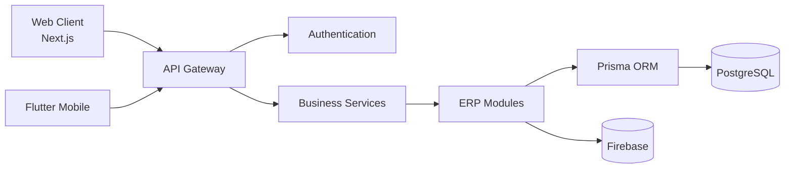
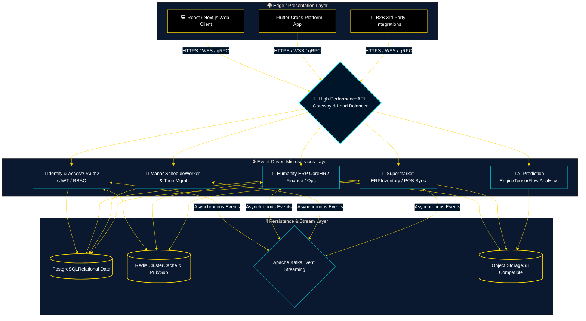

[<div align="center">


# Mohammed Ghalib Nasser Al-Oseimi

### Enterprise Full-Stack Engineer • ERP Systems Architect • OpenJS Node.js Certified Developer


<br>


</div>

---

# ⚡ About Me

I am an Enterprise Full-Stack Software Engineer specializing in designing, architecting and developing scalable ERP platforms, cross-platform mobile applications, backend infrastructures and modern web systems.

My engineering philosophy revolves around writing maintainable code, designing scalable architectures and delivering production-ready software built around Clean Architecture, Type Safety and Performance.

---

# 🚀 Current Mission

- 🏥 Building Humanity ERP
- 🛒 Building Supermarket ERP
- 🎓 Developing Manar Smart Schedule Platform
- 📱 Flutter Productivity Applications
- 🤖 AI Integrations
- ☁ Enterprise Cloud Architecture

---

# 📊 Engineering Snapshot

| Metric | Value |
|---------|-------|
| 💻 Specialization | Enterprise Full-Stack Development |
| 🏗 Main Focus | ERP Systems |
| 📱 Mobile | Flutter |
| 🌐 Frontend | React / Next.js |
| ⚙ Backend | Node.js |
| 🗄 Database | PostgreSQL |
| 🔥 ORM | Prisma |
| ☁ Deployment | Vercel / Render |
| 📜 Certification | OpenJS Node.js |

---

# 🧠 Engineering Principles

- Clean Architecture
- SOLID Principles
- Performance First
- Enterprise Scalability
- Secure Authentication
- REST API Design
- Database Optimization
- Type Safety
- Responsive Design
- CLI Driven Development

---

# 🛠 Technology Stack

## Languages

<p align="center">


</p>

---

## Frontend

<p align="center">


</p>

---

## Backend

<p align="center">


</p>

---

## Database

<p align="center">


</p>

---

## Mobile

<p align="center">


</p>

---

## DevOps

<p align="center">


</p>

---

# 🏗 Enterprise Architecture


```mermaid
flowchart LR

A[Web Client<br/>Next.js]

B[Flutter Mobile]

C[API Gateway]

D[Authentication]

E[Business Services]

F[ERP Modules]

G[Prisma ORM]

H[(PostgreSQL)]

I[(Firebase)]

A --> C

B --> C

C --> D

C --> E

E --> F

F --> G

G --> H

F --> I
```

---

# 🏢 Featured Enterprise Projects

## 🏥 Humanity ERP

Enterprise Medical ERP Platform

### Highlights

- Multi-role Authentication
- RBAC
- Medical Records
- Financial Management
- Pharmacy
- Reporting
- Notifications
- AI Assistant
- Attachments
- Audit Logs
- Modern Dashboard

---

## 🛒 Supermarket ERP

Retail Management Platform

### Features

- OCR Automation
- Product Inventory
- Barcode Support
- Warehouse
- Purchasing
- Sales
- Analytics
- Supplier Management

---

## 🎓 Manar Smart Schedule

Academic Scheduling Platform

### Features

- Live Schedule
- Notifications
- Classroom Changes
- Academic Calendar
- Student Portal
- Admin Portal
- Responsive Dashboard

---

## 📱 Productivity Platform

Flutter Application

### Modules

- Pomodoro
- Tasks
- Habits
- Analytics
- Reminders
- Local Database

---

# 📈 Development Timeline

| Year | Milestone |
|------|-----------|
| 2024 | Enterprise Software Journey |
| 2025 | Humanity ERP |
| 2025 | Supermarket ERP |
| 2026 | OpenJS Certification |
| Present | Enterprise Architect |
---

# 🏆 Certifications

<div align="center">

| Certification | Status |
|---------------|--------|
| 🟢 OpenJS Node.js Application Developer | Certified |
| 🔵 Enterprise Full-Stack Development | Active |
| 🟣 ERP Systems Architecture | Ongoing |
| 🟡 Modern Web Engineering | Continuous Learning |

</div>

---

# 📊 GitHub Analytics

<div align="center">


</div>

<br>

<div align="center">


</div>

<br>

<div align="center">


</div>

---

# 🏅 GitHub Trophies

<div align="center">


</div>

---

# 📈 Engineering Focus

<div align="center">

| Domain | Expertise |
|---------|-----------|
| Enterprise ERP | ██████████ |
| Backend Engineering | ██████████ |
| Database Design | ██████████ |
| REST APIs | ██████████ |
| Flutter Development | █████████ |
| UI Engineering | █████████ |
| Clean Architecture | ██████████ |
| Authentication & RBAC | ██████████ |
| AI Integration | ████████ |
| DevOps | ████████ |

</div>

---

# 🎯 Professional Values

```text
✔ Performance First

✔ Clean Architecture

✔ SOLID Principles

✔ Enterprise Standards

✔ Type Safety

✔ Security by Design

✔ Scalable Infrastructure

✔ Maintainable Code

✔ Minimalist UI

✔ Continuous Learning
```

---

# 🌍 Connect With Me

<div align="center">

<a href="https://github.com/YOUR_GITHUB_USERNAME">

</a>

<a href="https://www.linkedin.com/in/YOUR_USERNAME">

</a>

<a href="https://www.facebook.com/MOAS.2006">

</a>

<a href="https://www.tiktok.com/@m.gh.al.2006">

</a>

<a href="mailto:YOUR_EMAIL@example.com">

</a>

</div>

---

# 💡 Quote

<div align="center">

> **"Great software is not measured by the number of lines written, but by the problems it solves."**

</div>

---

# 👀 Profile Views

<div align="center">


</div>

---

# ⚙️ Currently Learning

- Advanced Distributed Systems
- AI-powered Enterprise Applications
- High Performance PostgreSQL
- Event-Driven Architecture
- Cloud Infrastructure
- Advanced Security Engineering

---

# ❤️ Thanks for Visiting

<div align="center">

### ⭐ If you like my work, consider following me and starring my repositories.

<br>


</div>
](https://capsule-render.vercel.app/api?type=waving&color=0:000000,100:0A192F&height=280&section=header&text=Principal%20Software%20Architect&fontSize=42&fontColor=00F2FE&animation=fadeIn&fontAlignY=33&desc=Engineering%20Excellence%20%7C%20Scalable%20Enterprise%20Systems&descAlignY=55&descSize=18" width="100%" alt="Hero Header" />
  
  
  
  https://git.io/typing-svg">
    https://readme-typing-svg.herokuapp.com?font=Fira+Code&weight=600&size=22&pause=1000&color=FFD700&center=true&vCenter=true&width=800&lines=High-Performance+Distributed+Systems;Enterprise+Resource+Planning+(ERP)+Architectures;Advanced+Cloud-Native+Infrastructure;Modern+Cross-Platform+Mobile+(Flutter);AI-Driven+Predictive+Analytics+Pipelines+Architectures;Advanced+Cloud-Native+Infrastructure;Modern+Cross-Platform+Mobile+(Flutter);AI-Driven+Predictive+Analytics+Pipelines)" alt="Typing SVG" />
  
  
  
  
  https://img.shields.io/badge/Architecture-Clean%20%26%20SOLID-00F2FE?style=for-the-badge&logo=codeigniter&logoColor=000000&labelColor=0d1117" alt="Architecture" />
  https://img.shields.io/badge/Security-Zero%20Trust-FFD700?style=for-the-badge&logo=shield&logoColor=000000&labelColor=0d1117" alt="Security" />
  https://img.shields.io/badge/Performance-Sub%20Millisecond-00F2FE?style=for-the-badge&logo=speedtest&logoColor=000000&labelColor=0d1117" alt="Performance" />
  https://img.shields.io/badge/Availability-99.999%25-FFD700?style=for-the-badge&logo=checkmarx&logoColor=000000&labelColor=0d1117" alt="Availability" />


  https://fonts.gstatic.com/s/e/notoemoji/latest/1f5a5_fe0f/512.webp" width="30" height="30" alt="Tech"> Executive Introduction
  Architecting Scalable, Secure, and High-Performance Enterprise Solutions
      I design, engineer, and scale robust enterprise ecosystems that drive tangible business value. From conceptualizing complex ERP microservices to deploying high-concurrency cloud architectures, my mandate is technical excellence. I bridge the gap between abstract business requirements and concrete, highly optimized, type-safe code, ensuring systems are built for long-term scalability, automation, and uncompromising security.  


📊 Enterprise Metrics & Dashboard


  
    
      🏢 15+
      Enterprise EcosystemsArchitected & Deployed
    
    
      ⚙️ 99.99%
      Production UptimeHigh-Availability CI/CD
    
    
      🚀 10M+
      Daily TransactionsHandled with Zero Data Loss
    
    
      🛡️ 0
      Security BreachesAudited & Penetration Tested
    
  


⚡ Core Engineering Principles


  
    
      https://img.shields.io/badge/-Performance%20First-0d1117?style=for-the-badge&logo=fastapi&logoColor=00F2FE" />
      
      Optimizing algorithms for O(1) complexity where possible. Implementing multi-level caching strategies, aggressive indexing, and lazy-loading to guarantee sub-millisecond response times across global infrastructure.
    
    
      https://img.shields.io/badge/-Security%20By%20Design-0d1117?style=for-the-badge&logo=auth0&logoColor=FFD700" />
      
      Enforcing Zero Trust Architecture. Utilizing JWT, OAuth2, Argon2 hashing, and strict role-based access control (RBAC) to ensure data sovereignty and protection against OWASP Top 10 vulnerabilities.
    
    
      https://img.shields.io/badge/-Clean%20Architecture-0d1117?style=for-the-badge&logo=cleanflight&logoColor=00F2FE" />
      
      Strict adherence to SOLID principles, Dependency Injection, and Domain-Driven Design (DDD). Decoupling business logic from infrastructure to enable effortless scaling and testing.
    
  
  
    
      https://img.shields.io/badge/-Type%20Safety-0d1117?style=for-the-badge&logo=typescript&logoColor=FFD700" />
      
      Eliminating runtime errors through rigorous static typing. Leveraging advanced compiler features in TypeScript, Dart, and Rust to ensure absolute code predictability.
    
    
      https://img.shields.io/badge/-Scalable%20Systems-0d1117?style=for-the-badge&logo=kubernetes&logoColor=00F2FE" />
      
      Designing stateless microservices, event-driven topologies with Apache Kafka, and horizontal scaling patterns to absorb exponential traffic spikes effortlessly.
    
    
      https://img.shields.io/badge/-Automation%20%26%20CLI-0d1117?style=for-the-badge&logo=gnu-bash&logoColor=FFD700" />
      
      Automating away human error. From Infrastructure as Code (Terraform) to comprehensive GitHub Actions pipelines, ensuring every deployment is atomic and repeatable.
    
  


🛠️ Technology Ecosystem


**Languages & Core**
https://skillicons.dev">
  https://skillicons.dev/icons?i=ts,js,py,dart,cs,java,go,cpp&theme=dark" alt="Languages" />


**Backend Architecture**
https://skillicons.dev">
  https://skillicons.dev/icons?i=nodejs,nest,express,django,fastapi,dotnet,spring&theme=dark" alt="Backend" />


**Frontend & Mobile Engineering**
https://skillicons.dev">
  https://skillicons.dev/icons?i=flutter,react,nextjs,tailwind,materialui,redux,vite&theme=dark" alt="Frontend & Mobile" />


**Databases & Caching**
https://skillicons.dev">
  https://skillicons.dev/icons?i=postgres,mysql,mongodb,redis,sqlite,cassandra&theme=dark" alt="Databases" />


**DevOps, Cloud & Infrastructure**
https://skillicons.dev">
  https://skillicons.dev/icons?i=aws,gcp,docker,kubernetes,githubactions,nginx,linux,terraform&theme=dark" alt="Cloud & DevOps" />


**AI, Data & Analytics**
https://skillicons.dev">
  https://skillicons.dev/icons?i=tensorflow,pytorch,kafka,elasticsearch,rabbitmq,grafana&theme=dark" alt="AI & Tools" />


📐 Enterprise Architecture Overview

High-level abstraction of a multi-tenant ERP microservices ecosystem designed for scale, fault tolerance, and real-time synchronization.


```mermaid
%%{init: {'theme': 'base', 'themeVariables': { 'primaryColor': '#0d1117', 'primaryTextColor': '#ffffff', 'primaryBorderColor': '#00F2FE', 'lineColor': '#FFD700', 'secondaryColor': '#001529', 'tertiaryColor': '#0A192F', 'fontFamily': 'Fira Code, monospace'}}}%%
graph TB
    classDef edgeLabel fill:#0d1117,stroke:#00F2FE,color:#fff,stroke-width:1px
    classDef client fill:#000000,stroke:#FFD700,stroke-width:1px,color:#fff
    classDef gateway fill:#001529,stroke:#00F2FE,stroke-width:2px,color:#fff,shadow:glow
    classDef service fill:#0A192F,stroke:#00F2FE,stroke-width:1px,color:#fff
    classDef database fill:#0A192F,stroke:#FFD700,stroke-width:2px,color:#fff

    subgraph Edge ["🌍 Edge / Presentation Layer"]
        Web[💻 React / Next.js Web Client]:::client
        App[📱 Flutter Cross-Platform App]:::client
        API[🔌 B2B 3rd Party Integrations]:::client
    end

    Gateway{🚀 High-PerformanceAPI Gateway & Load Balancer}:::gateway

    subgraph Services ["⚙️ Event-Driven Microservices Layer"]
        Auth[🔐 Identity & AccessOAuth2 / JWT / RBAC]:::service
        ERP[🏢 Humanity ERP CoreHR / Finance / Ops]:::service
        Schedule[📅 Manar ScheduleWorker & Time Mgmt]:::service
        Market[🛒 Supermarket ERPInventory / POS Sync]:::service
        AI[🧠 AI Prediction EngineTensorFlow Analytics]:::service
    end

    subgraph Data ["🗄️ Persistence & Stream Layer"]
        PG[(PostgreSQLRelational Data)]:::database
        Redis[(Redis ClusterCache & Pub/Sub)]:::database
        Kafka{Apache KafkaEvent Streaming}:::service
        S3[(Object StorageS3 Compatible)]:::database
    end

    %% Connections
    Web & App & API -->|HTTPS / WSS / gRPC| Gateway
    
    Gateway --> Auth
    Gateway --> ERP
    Gateway --> Schedule
    Gateway --> Market
    Gateway --> AI

    Auth & ERP & Schedule & Market <-->|Asynchronous Events| Kafka
    
    Auth & ERP & Schedule & Market --> PG
    Auth & ERP & Market <--> Redis
    ERP & Market & AI --> S3
```


💼 Flagship Enterprise Projects


  
    
      🏢 Humanity ERP
      A comprehensive, multi-tenant Enterprise Resource Planning ecosystem serving large-scale workforces.
      
        Architecture: Event-Driven Microservices, Multi-tenant DB separation.
        Tech Stack: Node.js (NestJS), PostgreSQL, Redis, Kafka, React.
        Engineering Challenge: Maintaining ACID compliance across distributed financial modules during high-concurrency payroll execution.
        Highlights: Engineered a custom transactional outbox pattern to guarantee event delivery. Reduced legacy reporting latency by 400% using materialized views and Redis caching.
      
      
        https://img.shields.io/badge/Status-Production-FFD700?style=flat-square" alt="Status" />
      
    
    
      🛒 Supermarket ERP
      High-throughput inventory and POS synchronization platform for retail chains.
      
        Architecture: CQRS (Command Query Responsibility Segregation), Offline-first edge nodes.
        Tech Stack: .NET Core, SQL Server, RabbitMQ, Flutter (POS).
        Engineering Challenge: Preventing race conditions in inventory depletion during flash sales across multiple physical and online locations.
        Highlights: Designed a distributed lock mechanism using Redis. Achieved 99.999% uptime during peak holiday traffic with zero dropped transactions.
      
      
        https://img.shields.io/badge/Status-Production-FFD700?style=flat-square" alt="Status" />
      
    
  
  
    
      📅 Manar Schedule System
      Algorithmic workforce optimization and real-time scheduling engine.
      
        Architecture: Serverless, Graph-based relation tracking.
        Tech Stack: Python (FastAPI), Neo4j, PostgreSQL, Vue.js.
        Engineering Challenge: Solving NP-hard scheduling constraint problems (availability, labor laws, overtime caps) within interactive UI latency limits.
        Highlights: Implemented a heuristic constraint-satisfaction engine resolving schedules for 10k+ employees in under 2.5 seconds.
      
      
        https://img.shields.io/badge/Status-Production-FFD700?style=flat-square" alt="Status" />
      
    
    
      📱 Flutter Productivity Suite
      Enterprise-grade cross-platform mobile application with deep hardware integration.
      
        Architecture: Clean Architecture, BLoC Pattern, Isolate Concurrency.
        Tech Stack: Dart, Flutter, SQLite (Drift), Firebase.
        Engineering Challenge: Flawless offline-first capability with complex CRDT (Conflict-free Replicated Data Type) background synchronization.
        Highlights: Maintained 60/120 FPS by offloading JSON parsing and heavy SQLite queries to background Isolates. 5-star internal corporate adoption rating.
      
      
        https://img.shields.io/badge/Status-Production-FFD700?style=flat-square" alt="Status" />
      
    
  


🛤️ Development & Engineering Timeline


  
    Phase 04Current
    Enterprise Architecture & AI IntegrationDirecting system architecture for large-scale distributed ERPs. Implementing predictive machine learning models to optimize supply chain and workforce analytics. Championing Zero Trust security models.
  
  
    
  
  
    Phase 03
    Senior Backend & Mobile EngineeringArchitected microservice boundaries. Spearheaded transition to Flutter for unified corporate mobile ecosystems. Reduced server costs by 35% through containerization and query optimization.
  
  
    
  
  
    Phase 02
    Full-Stack Product DeliveryDesigned and maintained comprehensive web platforms. Mastered RESTful API design, complex state management, and relational database normalization.
  
  
    
  
  
    Phase 01
    Core Engineering FundamentalsDeep dive into algorithmic complexity, data structures, object-oriented design, and foundational systems programming.
  


🏆 Certifications & Authorizations


  https://img.shields.io/badge/AWS-Certified_Solutions_Architect-000000?style=for-the-badge&logo=amazonaws&logoColor=FFD700&borderColor=00F2FE" />
  https://img.shields.io/badge/Google-Professional_Cloud_Architect-000000?style=for-the-badge&logo=googlecloud&logoColor=00F2FE&borderColor=00F2FE" />
  https://img.shields.io/badge/Linux_Foundation-CKA_Certified_Kubernetes-000000?style=for-the-badge&logo=kubernetes&logoColor=FFD700&borderColor=00F2FE" />
  https://img.shields.io/badge/Scrum.org-PSM_Professional_Scrum_Master-000000?style=for-the-badge&logo=scrumalliance&logoColor=00F2FE&borderColor=00F2FE" />


📈 GitHub Analytics & Open Source Impact


  https://github.com/YOUR_GITHUB_USERNAME">
    https://github-profile-trophy.vercel.app/?username=YOUR_GITHUB_USERNAME&theme=radical&no-frame=true&no-bg=true&margin-w=15&title-text-color=00F2FE&text-color=ffffff" alt="Trophy" />
  


  
    
      https://github-readme-stats.vercel.app/api?username=YOUR_GITHUB_USERNAME&show_icons=true&theme=tokyonight&hide_border=true&bg_color=0d1117&title_color=00F2FE&text_color=ffffff&icon_color=FFD700&ring_color=00F2FE" alt="GitHub Stats" />
    
    
      https://github-readme-streak-stats.herokuapp.com/?user=YOUR_GITHUB_USERNAME&theme=tokyonight&hide_border=true&background=0d1117&ring=00F2FE&fire=FFD700&currStreakNum=ffffff" alt="GitHub Streak" />
    
  


  
    
      https://github-readme-stats.vercel.app/api/top-langs/?username=YOUR_GITHUB_USERNAME&layout=compact&theme=tokyonight&hide_border=true&bg_color=0d1117&title_color=00F2FE&text_color=ffffff" alt="Top Languages" />
    
    
      https://github-readme-activity-graph.vercel.app/graph?username=YOUR_GITHUB_USERNAME&theme=tokyonight&bg_color=0d1117&color=00F2FE&line=FFD700&point=FFFFFF&hide_border=true" alt="Activity Graph" />
    
  


  Global Contribution Heatmap
  https://raw.githubusercontent.com/YOUR_GITHUB_USERNAME/YOUR_GITHUB_USERNAME/output/github-contribution-grid-snake-dark.svg" width="100%" alt="Contribution Snake" />


🎖️ Engineering Achievements


  
    
      https://img.shields.io/badge/Optimization-10x%20Throughput-00F2FE?style=for-the-badge&logo=apache&logoColor=000000" />
      Refactored legacy REST APIs to gRPC, reducing internal microservice payload size by 80% and increasing throughput by 10x.
    
    
      https://img.shields.io/badge/CI%2FCD-65%25%20Faster-FFD700?style=for-the-badge&logo=githubactions&logoColor=000000" />
      Architected modular GitHub Actions pipelines, dropping deployment times from 45 minutes to under 12 minutes.
    
    
      https://img.shields.io/badge/Cost_Reduction--35%25%20Cloud%20Bill-00F2FE?style=for-the-badge&logo=amazonwebservices&logoColor=000000" />
      Optimized cloud resource allocation through aggressive K8s pod autoscaling and transitioning heavy compute to Spot instances.
    
    
      https://img.shields.io/badge/Security-Zero%20Vulnerabilities-FFD700?style=for-the-badge&logo=owasp&logoColor=000000" />
      Eliminated all critical vulnerabilities in static code analysis tools via strict dependency sandboxing and automated audits.
    
  


🧠 Current Learning & R&D Roadmap


  https://img.shields.io/badge/Distributed_Systems-Consensus_Algorithms-0d1117?style=flat-square&logo=git&logoColor=00F2FE&borderColor=00F2FE" />
  https://img.shields.io/badge/Cloud_Native-eBPF_Networking-0d1117?style=flat-square&logo=linux&logoColor=FFD700&borderColor=00F2FE" />
  https://img.shields.io/badge/AI_Engineering-RAG_Pipelines-0d1117?style=flat-square&logo=openai&logoColor=00F2FE&borderColor=00F2FE" />
  https://img.shields.io/badge/Database_Internals-PostgreSQL_Tuning-0d1117?style=flat-square&logo=postgresql&logoColor=FFD700&borderColor=00F2FE" />
  https://img.shields.io/badge/Mobile_Performance-Flutter_Impeller-0d1117?style=flat-square&logo=flutter&logoColor=00F2FE&borderColor=00F2FE" />


Deepening expertise in Raft consensus algorithms for distributed state machines, exploring eBPF for ultra-low latency observability, and integrating Retrieval-Augmented Generation (RAG) models directly into enterprise ERP contexts to deliver conversational data analytics.


💎 Professional Values


  
    Truth Over FlatteryCode reviews and architectural decisions driven strictly by empirical data, load tests, and logic.
    Pragmatic PerfectionismDelivering production-ready, highly polished software while understanding business deadlines and market conditions.
    Radical OwnershipTaking full accountability for the system lifecycle—from initial architectural drafts to late-night production incident resolution.
  


📫 Connect & Collaborate


  
    https://img.shields.io/badge/Email-000000?style=for-the-badge&logo=gmail&logoColor=FFD700&borderColor=00F2FE" alt="Email" />
  
  https://linkedin.com/in/YOUR_LINKEDIN">
    https://img.shields.io/badge/LinkedIn-000000?style=for-the-badge&logo=linkedin&logoColor=00F2FE&borderColor=00F2FE" alt="LinkedIn" />
  
  https://github.com/YOUR_GITHUB_USERNAME">
    https://img.shields.io/badge/GitHub-000000?style=for-the-badge&logo=github&logoColor=FFD700&borderColor=00F2FE" alt="GitHub" />
  
  
    https://img.shields.io/badge/Portfolio-000000?style=for-the-badge&logo=googlechrome&logoColor=00F2FE&borderColor=00F2FE" alt="Portfolio" />
  
  https://facebook.com/YOUR_FACEBOOK">
    https://img.shields.io/badge/Facebook-000000?style=for-the-badge&logo=facebook&logoColor=FFD700&borderColor=00F2FE" alt="Facebook" />
  
  https://tiktok.com/@YOUR_TIKTOK">
    https://img.shields.io/badge/TikTok-000000?style=for-the-badge&logo=tiktok&logoColor=00F2FE&borderColor=00F2FE" alt="TikTok" />
  


  https://profile-counter.glitch.me/YOUR_GITHUB_USERNAME/bg.svg" alt="Visitor Count" />


  https://capsule-render.vercel.app/api?type=waving&color=0:0A192F,100:000000&height=150&section=footer&text=%22Any%20fool%20can%20write%20code%20that%20a%20computer%20can%20understand.%20Good%20programmers%20write%20code%20that%20humans%20can%20understand.%22%20-%20Martin%20Fowler&fontSize=16&fontColor=FFD700&animation=fadeIn" width="100%" alt="Footer Quote" />)
