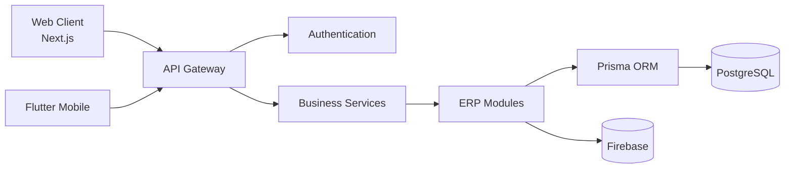

# Mohammed Ghalib Nasser Al-Oseimi

### Enterprise Full-Stack Engineer • ERP Systems Architect • OpenJS Node.js Certified Developer

 

---

# ⚡ About Me

I am an Enterprise Full-Stack Software Engineer specializing in designing, architecting and developing scalable ERP platforms, cross-platform mobile applications, backend infrastructures and modern web systems.

My engineering philosophy revolves around writing maintainable code, designing scalable architectures and delivering production-ready software built around Clean Architecture, Type Safety and Performance.

---

# 🚀 Current Mission

- 🏥 Building Humanity ERP
- 🛒 Building Supermarket ERP
- 🎓 Developing Manar Smart Schedule Platform
- 📱 Flutter Productivity Applications
- 🤖 AI Integrations
- ☁ Enterprise Cloud Architecture

---

# 📊 Engineering Snapshot

| Metric | Value |
|---------|-------|
| 💻 Specialization | Enterprise Full-Stack Development |
| 🏗 Main Focus | ERP Systems |
| 📱 Mobile | Flutter |
| 🌐 Frontend | React / Next.js |
| ⚙ Backend | Node.js |
| 🗄 Database | PostgreSQL |
| 🔥 ORM | Prisma |
| ☁ Deployment | Vercel / Render |
| 📜 Certification | OpenJS Node.js |

---

# 🧠 Engineering Principles

- Clean Architecture
- SOLID Principles
- Performance First
- Enterprise Scalability
- Secure Authentication
- REST API Design
- Database Optimization
- Type Safety
- Responsive Design
- CLI Driven Development

---

# 🛠 Technology Stack

## Languages

---

## Frontend

---

## Backend

---

## Database

---

## Mobile

---

## DevOps

---

# 🏗 Enterprise Architecture

```mermaid
flowchart LR

A[Web Client<br/>Next.js]

B[Flutter Mobile]

C[API Gateway]

D[Authentication]

E[Business Services]

F[ERP Modules]

G[Prisma ORM]

H[(PostgreSQL)]

I[(Firebase)]

A --> C

B --> C

C --> D

C --> E

E --> F

F --> G

G --> H

F --> I
```

---

# 🏢 Featured Enterprise Projects

## 🏥 Humanity ERP

Enterprise Medical ERP Platform

### Highlights

- Multi-role Authentication
- RBAC
- Medical Records
- Financial Management
- Pharmacy
- Reporting
- Notifications
- AI Assistant
- Attachments
- Audit Logs
- Modern Dashboard

---

## 🛒 Supermarket ERP

Retail Management Platform

### Features

- OCR Automation
- Product Inventory
- Barcode Support
- Warehouse
- Purchasing
- Sales
- Analytics
- Supplier Management

---

## 🎓 Manar Smart Schedule

Academic Scheduling Platform

### Features

- Live Schedule
- Notifications
- Classroom Changes
- Academic Calendar
- Student Portal
- Admin Portal
- Responsive Dashboard

---

## 📱 Productivity Platform

Flutter Application

### Modules

- Pomodoro
- Tasks
- Habits
- Analytics
- Reminders
- Local Database

---

# 📈 Development Timeline

| Year | Milestone |
|------|-----------|
| 2024 | Enterprise Software Journey |
| 2025 | Humanity ERP |
| 2025 | Supermarket ERP |
| 2026 | OpenJS Certification |
| Present | Enterprise Architect |
